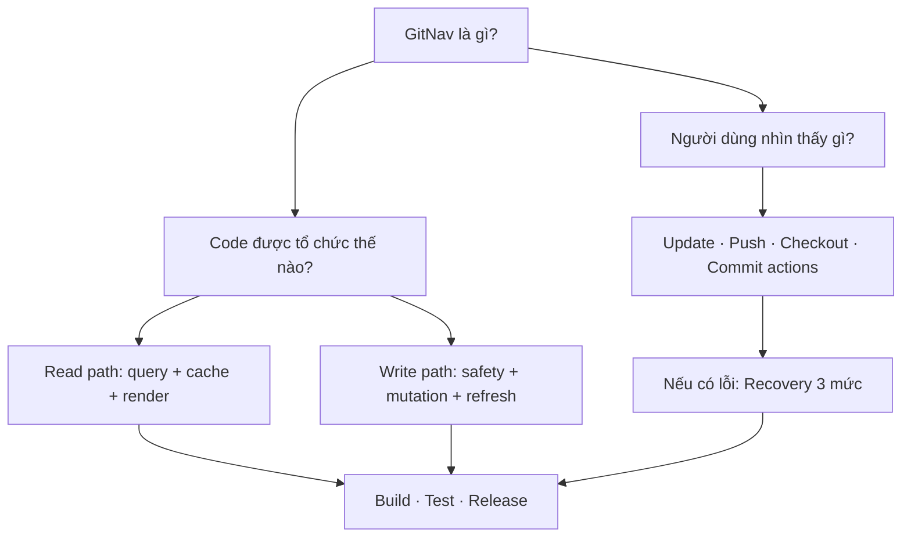
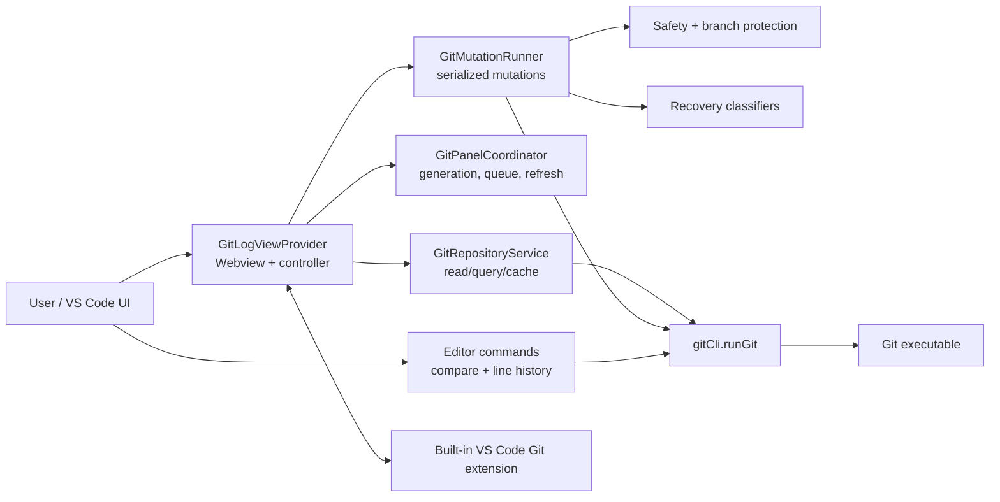
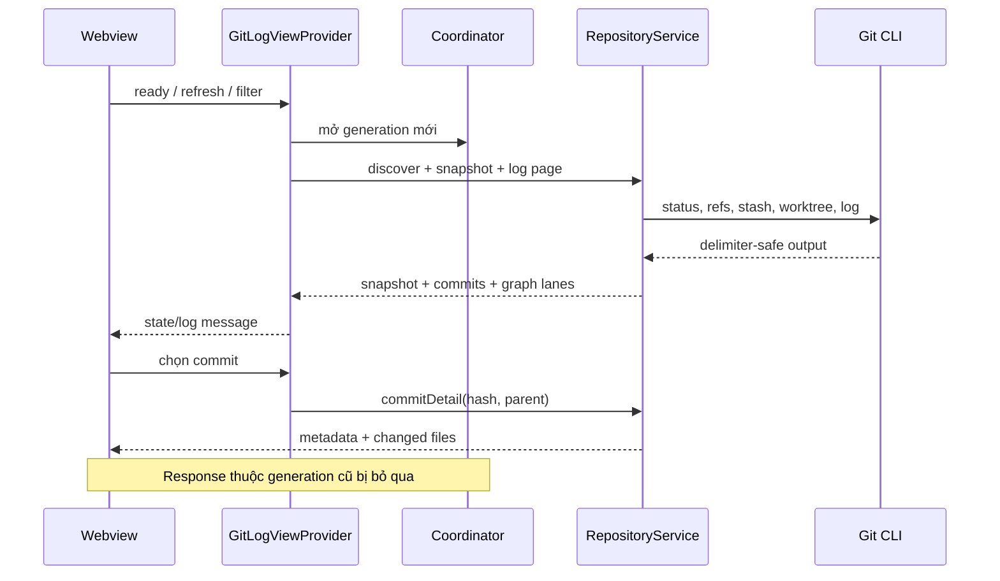
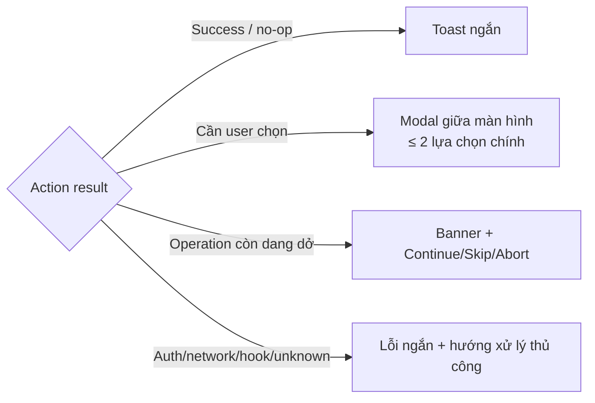
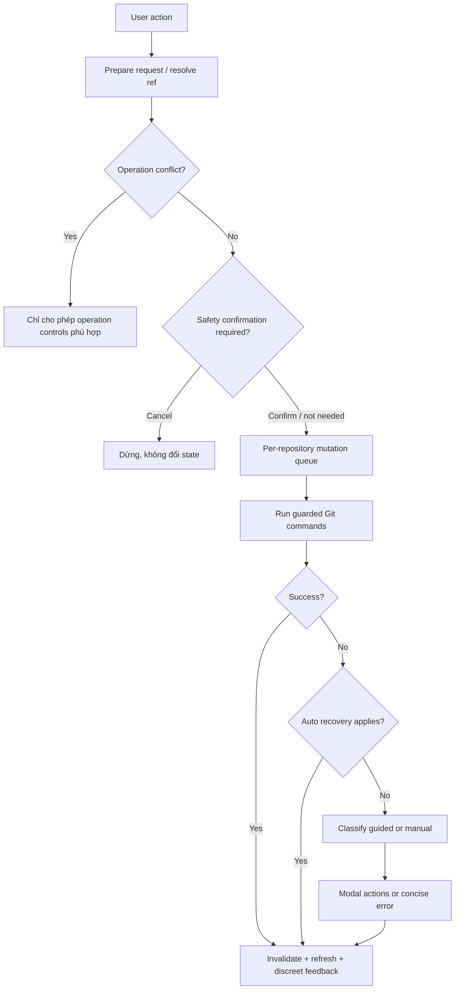

# GitNav — System & Source Handoff Guide

> Tài liệu bàn giao kỹ thuật cho GitNav `0.7.0`. Nội dung được đối chiếu với source tại `extensions/gitnav` trên nhánh `master` ngày 2026-07-16. Khi tài liệu và code khác nhau, code cùng test tự động là nguồn sự thật cuối cùng.

## Đọc nhanh tài liệu này

Không cần đọc từ đầu đến cuối. Chọn đường đọc phù hợp:

| Bạn là ai? | Nên đọc theo thứ tự |
|---|---|
| Người dùng/PO/QA | [Tổng quan](#2-tổng-quan-sản-phẩm) → [UI](#7-ui-và-trải-nghiệm-chính) → [Update](#10-update-workflow) → [Push](#11-push-workflow) → [Checkout remote](#12-checkout-remote-workflow) → [Recovery](#14-recovery-ba-mức) |
| Developer mới | [Kiến trúc](#4-kiến-trúc-hệ-thống) → [Source map](#5-bản-đồ-source-code) → [Read flow](#6-mô-hình-dữ-liệu-và-read-flow) → [Mutation pipeline](#9-mutation-pipeline) → [Build/test](#19-build-test-và-chạy-local) |
| AI coding agent | [AI context index](#27-ai-context-index) → [Invariant](#92-các-invariant-không-được-phá-vỡ) → module liên quan → tests tương ứng |
| Maintainer/Reviewer | [Safety](#15-safety-và-protected-branches) → [Test strategy](#21-test-strategy) → [Mở rộng an toàn](#22-hướng-dẫn-mở-rộng-an-toàn) → [Giới hạn](#23-giới-hạn-và-quyết-định-thiết-kế-cần-biết) |

### Bản đồ nội dung



> **Quy ước từ ngữ:** *read/query* là thao tác không đổi repository; *mutation* là thao tác có thể đổi Git state; *operation* là merge/rebase/cherry-pick/revert đang dang dở; *recovery* là cách hệ thống phản ứng sau lỗi.

## 1. Mục đích tài liệu

Tài liệu này giúp một đội mới nhận source có thể:

- hiểu GitNav giải quyết vấn đề gì và không làm gì;
- xác định nhanh entry point, module chịu trách nhiệm và dữ liệu đi qua hệ thống;
- hiểu các Git workflow, điều kiện rẽ nhánh và cơ chế xử lý lỗi;
- build, test, debug, đóng gói và phát hành extension;
- thay đổi tính năng mà không phá vỡ safety, concurrency hoặc UX hiện có.

Đây là tài liệu kỹ thuật hệ thống, không thay thế hướng dẫn ngắn cho người dùng trong `extensions/gitnav/README.md`.

## 2. Tổng quan sản phẩm

GitNav là VS Code extension độc lập cung cấp lịch sử Git trực quan và các workflow Git có guard. Extension chạy Git CLI trực tiếp, không phụ thuộc .NET và không thay thế hoàn toàn Source Control view của VS Code.

Các giá trị chính:

1. Duyệt commit graph, branch, tag, stash và worktree trong một panel ba cột.
2. Tìm kiếm/lọc lịch sử và xem changed files/diff nhanh.
3. Thực hiện branch/commit/stash/worktree workflow với xác nhận phù hợp rủi ro.
4. Đưa lỗi Git về ba mức recovery: tự xử lý, hướng dẫn lựa chọn, hoặc báo lỗi thủ công.
5. Hỗ trợ line history và compare trực tiếp từ editor selection.

### 2.1 Phạm vi hiện tại

GitNav có thể đọc lịch sử và thực hiện nhiều mutation Git, nhưng chưa phải một Git client toàn phần. Extension không cung cấp UI staging/unstaging, soạn commit thường, quản lý credential, resolve conflict trực quan hoặc cấu hình remote tổng quát. Những việc đó tiếp tục dùng VS Code SCM, editor merge hoặc Git CLI.

### 2.2 Yêu cầu chạy

- VS Code `^1.92.0`.
- Git CLI có trong `PATH`.
- Workspace chứa Git repository. Hỗ trợ nhiều repository trong cùng workspace.
- Node.js dùng cho phát triển/build; CI hiện dùng Node 22.

## 3. Bề mặt tích hợp với VS Code

Package: `extensions/gitnav/package.json`

| Thành phần | ID / command | Vai trò |
|---|---|---|
| Bottom panel container | `gitnavPanel` | Container “GitNav” |
| Webview view | `gitnav.gitLog` | Git Log chính |
| Editor command | `gitnav.showHistoryForSelection` | Lịch sử của dòng/selection |
| Editor command | `gitnav.compareFileWithBranch` | So sánh file với branch/ref |
| Editor command | `gitnav.compareSelectionWithBranch` | So sánh selection với branch/ref |
| Settings command | `gitnav.openSettings` | Mở settings của extension |

Extension activate khi panel hoặc một trong các command trên được gọi. Entry point runtime là `extensions/gitnav/src/extension.ts`, compile ra `extensions/gitnav/out/extension.js`.

## 4. Kiến trúc hệ thống



Nguyên tắc phân lớp:

- Webview không tự chạy Git. JavaScript phía client gửi message cho extension host.
- Read/query đi qua `GitRepositoryService`; mutation đi qua `GitMutationRunner`.
- Safety được đánh giá trước mutation; recovery được đánh giá sau failure.
- Refresh/cancel/generation đảm bảo UI không nhận dữ liệu cũ sau thao tác mới.
- Git command chạy bằng `child_process.spawn('git', args, { shell: false })`, tránh shell interpolation và hỗ trợ cancellation token.

## 5. Bản đồ source code

### 5.1 Composition và UI

| File | Trách nhiệm |
|---|---|
| `src/extension.ts` | Activate/deactivate, đăng ký provider/command, nối built-in Git extension |
| `src/git/gitLogViewProvider.ts` | Controller trung tâm, message routing, UI HTML/CSS/JS, menu/action preparation, modal/toast |
| `src/git/gitPanelModels.ts` | Kiểu dữ liệu snapshot, commit, file, filter, mutation |
| `src/git/gitActionPolicy.ts` | Label, severity, progress mode, feedback mode và nhóm context action |
| `src/git/gitPanelCoordinator.ts` | Request generation, per-repo state, mutation queue, coalesced refresh, duplicate guard |

### 5.2 Read path

| File | Trách nhiệm |
|---|---|
| `src/git/gitRepositoryService.ts` | Discover repository, snapshot, log page, commit detail, diff/file/ref queries, cache |
| `src/git/gitPanelParsers.ts` | Parse output Git an toàn bằng delimiter/NUL |
| `src/git/gitGraphLayout.ts` | Tính lane graph và giữ continuity giữa các page |
| `src/git/boundedCache.ts` | Cache giới hạn kích thước |
| `src/git/gitCli.ts` | Spawn Git, gom stdout/stderr, cancellation, tìm repository root |
| `src/git/gitRevisionProvider.ts` | Virtual document cho revision/diff |

### 5.3 Mutation, safety và recovery

| File | Trách nhiệm |
|---|---|
| `src/git/gitMutationRunner.ts` | Map action thành Git arguments/workflow và chạy tuần tự |
| `src/git/gitMutationSafety.ts` | Xác nhận action destructive và backup option khi phù hợp |
| `src/git/gitBranchProtection.ts` | Match protected branch pattern và chặn remote history rewrite nguy hiểm |
| `src/git/gitMutationLifecycle.ts` | Refresh sau success/failure, giữ nguyên lỗi gốc nếu refresh cũng lỗi |
| `src/git/gitMutationRecovery.ts` | Auto-recovery cho empty/no-op sequencer và state đã kết thúc |
| `src/git/gitErrorRecovery.ts` | Phân loại lỗi guided/manual và tạo tối đa hai action ngắn |
| `src/git/gitOperationFlow.ts` | Continue/skip/abort theo operation đang hoạt động |
| `src/git/gitPush.ts` | Same-name origin push/upstream behavior |
| `src/git/gitPushRecovery.ts` | Fetch → rebase/merge → push khi non-fast-forward |
| `src/git/gitPushRecoveryPreferences.ts` | Ghi nhớ lựa chọn recovery theo repository |
| `src/git/gitInteractiveRebase.ts` | Tạo và thực thi interactive rebase plan |
| `src/git/gitLocalSync.ts` | Đồng bộ trạng thái với built-in Git extension |

### 5.4 Editor workflows

| File | Trách nhiệm |
|---|---|
| `src/git/branchCompare.ts` | Chọn ref và tạo compare document |
| `src/git/lineHistory.ts` | Truy vấn `git log -L` và chuẩn hóa kết quả |
| `src/git/lineMapping.ts` | Map line dirty working tree về vị trí tương ứng tại `HEAD` |
| `src/git/lineHistoryPanel.ts` | UI line history và diff theo commit |

### 5.5 Tests

Tests nằm tại `extensions/gitnav/src/test`. Các nhóm quan trọng bao phủ parser, graph paging, coordinator, action policy, mutation safety/lifecycle/recovery, push semantics/recovery, line mapping/history và integration với repository Git thật.

## 6. Mô hình dữ liệu và read flow

### 6.1 Repository snapshot

Một snapshot đại diện trạng thái repository tại thời điểm đọc:

- root/name;
- HEAD, detached state, upstream;
- ahead/behind, số file thay đổi;
- operation đang hoạt động;
- refs local/remote/tag;
- stash và worktree;
- thời điểm fetch gần nhất do GitNav thực hiện.

Snapshot được tạo song song từ `git status --porcelain=v2 --branch -z`, `for-each-ref`, `stash list` và `worktree list --porcelain`.

### 6.2 Luồng tải panel



### 6.3 Cache và paging

- Repository discovery cache: 10 giây, đồng thời gộp request đang chạy.
- Snapshot cache: 300 ms; dùng generation để không ghi cache stale.
- Log cache: tối đa 30 entry.
- Commit detail cache: tối đa 80 entry.
- Commit log lấy thêm một record để xác định `hasMore`.
- Graph snapshot được giữ theo offset để lane không nhảy khi tải trang tiếp theo.
- Mutation invalidate snapshot/log/graph tương ứng repository.

## 7. UI và trải nghiệm chính

### 7.1 Bố cục

Panel chính có ba vùng:

1. **Branches**: current branch, recent/favorite, local, remote, tag, worktree, stash.
2. **Commit graph/list**: graph lane, subject, author, date; virtualized và phân trang.
3. **Detail / Changed Files**: metadata commit và danh sách file dạng tree hoặc flat.

Kích thước panel trái/phải, chiều cao detail, độ rộng cột, cột hiển thị, folder collapse, favorite/recent branch và commit đang chọn được lưu bằng webview `localStorage`.

Wireframe khái niệm (không thể hiện chính xác màu sắc/kích thước):

```text
┌──────────────────────────────────────────────────────────────────────────────┐
│ Repository ▾ │ develop ▾ │ Search commits… │ Filters │ ↻ │ Fetch │ Update │ Push │
├──────────────────┬───────────────────────────────────┬───────────────────────┤
│ BRANCHES         │ GRAPH  COMMIT      AUTHOR   DATE  │ COMMIT DETAIL         │
│ Search branches  │ ●────  resolve…    dat      3d    │ subject + metadata    │
│                  │ │ ●──  implement…  tuan     3d    ├───────────────────────┤
│ ★ develop        │ ●─┘    fix…        dat      6d    │ CHANGED FILES         │
│ LOCAL            │                                   │ src/                  │
│   master         │      virtualized commit list      │   git/…        +12 -3 │
│ REMOTE           │                                   │   ui/…          +4 -1 │
│ TAG / WORKTREE   │                                   │ Tree ▾  Collapse      │
└──────────────────┴───────────────────────────────────┴───────────────────────┘
```

Một thao tác bình thường nên đi theo nhịp: **chọn đối tượng → chọn action → chỉ xác nhận nếu có rủi ro → xem kết quả ngắn**.

### 7.2 Toolbar

- Repository selector khi workspace có nhiều repository.
- Current branch/ref picker.
- Search commit và filter mở rộng.
- Refresh, Fetch, Update, Push và menu bổ sung.
- Update thay cho khái niệm Pull ở UI: chỉ fetch nếu không có incoming commit; fast-forward khi chỉ behind; hỏi Rebase/Merge khi diverged.

### 7.3 Search và filter

Hỗ trợ:

- text hoặc commit hash;
- author;
- path;
- since/until;
- regex và match case;
- một hoặc nhiều branch/ref.

Khi search branch, current branch luôn được giữ như một lựa chọn dễ truy cập để user vẫn thao tác được với branch đang đứng.

### 7.4 Commit list

- Virtualized rendering để giới hạn DOM row.
- Infinite/paged loading.
- Click, `Shift`, `Ctrl/Cmd` để chọn một hoặc nhiều commit.
- Keyboard `Arrow Up/Down`; `Enter` mở diff file đầu tiên.
- Resize/hide cột; graph SVG overlay.
- Copy nhanh hash/ref và context menu theo selection.

### 7.5 Changed Files

- Tree/flat mode, collapse/expand toàn bộ.
- Status, additions/deletions và compact row.
- Chọn file mở diff; context menu cho commit file hoặc working-tree file.
- Hover file hiện `Open local file`; `Ctrl/Cmd+Enter` mở working-tree file tại dòng tương ứng với vị trí đang xem trong diff để tiếp tục chỉnh sửa.
- Nếu file không còn ở local, GitNav hiển thị thông báo ngắn và cho phép `Restore from Commit` khi có commit nguồn.
- Merge commit hỗ trợ xem theo từng parent hoặc combined files.

### 7.6 Feedback

- **Toast kín đáo**: success/no-op, auto-recovery hoặc lỗi không có action trực tiếp.
- **Modal giữa màn hình**: khi user cần quyết định ngay, tối đa hai primary choices trong recovery thông thường.
- **Operation banner**: khi merge/rebase/cherry-pick/revert còn dang dở.
- Nội dung ưu tiên ngắn, nêu hậu quả; chi tiết Git không biến popup thành report.

### 7.7 Ví dụ thông báo

Các ví dụ dưới đây mô tả tone và lượng thông tin, không phải chuỗi bắt buộc tuyệt đối.

**No-op — toast, tự biến mất**

```text
Already up to date
```

**Update diverged — modal giữa màn hình**

```text
Update develop

Local and origin both have new commits.

[ Rebase ]  [ Merge ]  [ Cancel ]
```

**Checkout remote có dữ liệu local — modal giữa màn hình**

```text
Checkout origin/develop?

Local develop has unpublished commits or working changes.

[ Keep Local ]  [ Reset to Origin ]  [ Cancel ]
```

**Auto-recovery — toast kín đáo**

```text
Empty cherry-pick skipped
```

**Manual recovery — không đưa action gây hiểu nhầm**

```text
Push failed: authentication required

Check your Git credentials, then try again.
```



## 8. Danh mục tính năng theo đối tượng

### 8.1 Local branch

- Checkout.
- Update current branch; push current branch.
- Compare với current branch.
- Merge hoặc rebase.
- Push branch, update từ same-name origin branch, update rồi checkout, checkout rồi rebase.
- Create/rename/delete branch.
- Add worktree.
- Xem working-tree diff và copy ref.

### 8.2 Remote branch

- Checkout/track remote branch.
- Compare, merge hoặc rebase với current branch.
- Update rồi checkout.
- Create local branch từ ref.
- Pull remote ref vào branch hiện tại.
- Xem working-tree diff, copy ref và delete remote branch.

### 8.3 Tag

- Show in log.
- Detached checkout hoặc tạo branch.
- Copy ref.
- Xóa local tag hoặc local + `origin` tag.

### 8.4 Stash

- Apply, pop, xem diff.
- Tạo branch từ stash.
- Drop có xác nhận.

### 8.5 Commit

- Xem repository/working-tree diff.
- Cherry-pick, revert.
- Create branch, detached checkout, create tag.
- Mở commit trên GitHub/GitLab URL được hỗ trợ.
- Copy hash/subject/message/author.
- Undo commit, reset, drop commit.
- Multi-select: compare range, cherry-pick/revert nhiều commit, interactive rebase.

### 8.6 File

- Commit file: diff, file history, mở revision, mở working file, copy path, revert/get file.
- Working-tree file: diff, mở file, rollback file.

### 8.7 Worktree

- Mở folder ở window mới.
- Mở terminal.
- Remove, force remove khi cần, unlock và prune stale metadata.

## 9. Mutation pipeline

Mọi action thay đổi repository phải đi qua cùng pipeline; không gọi Git trực tiếp từ webview handler mới.

### 9.1 Luồng xử lý



### 9.2 Các invariant không được phá vỡ

- Mutation tuần tự theo repository; repository khác có thể hoạt động độc lập.
- Request giống hệt đang chạy được chặn để tránh double click tạo mutation trùng.
- Sau success hoặc failure đều cố refresh để phản ánh trạng thái Git thật.
- Nếu mutation lỗi và refresh cũng lỗi, lỗi mutation ban đầu được giữ lại.
- Built-in Git extension được yêu cầu refresh sau mutation.
- Khi operation đang hoạt động, chỉ `continue`, `abort`, `skip`, `commitEmptyContinue` và `fetch` được phép.

## 10. Update workflow

Update luôn dựa vào `origin/<current-branch>` cùng tên, không phụ thuộc upstream đang trỏ nhánh khác.

| Trạng thái sau `fetch origin --prune` | Hành vi |
|---|---|
| Không có `origin/<branch>` | Báo remote branch không tồn tại; không tự đoán remote/ref khác |
| Incoming = 0 | Kết thúc như Fetch/no-op, feedback kín đáo |
| Behind > 0, ahead = 0 | Merge fast-forward từ same-name origin branch |
| Ahead > 0, behind > 0 | Modal giữa màn hình: **Rebase** hoặc **Merge** |
| Working tree/operation không cho phép | Git error được đưa qua recovery classifier |

Update diverged không tự chọn chiến lược để tránh viết lại lịch sử ngoài ý muốn.

## 11. Push workflow

### 11.1 Push bình thường

- Push explicit refspec của current branch lên branch cùng tên trên `origin`.
- Nếu remote branch chưa tồn tại: tạo branch và thiết lập upstream.
- Nếu upstream cũ trỏ sai branch: sau push, upstream được sửa về same-name origin branch.
- Detached HEAD không có current branch hợp lệ để dùng flow này.

### 11.2 Non-fast-forward recovery

Khi push bị reject vì remote có commit mới:

1. Hiện modal giữa màn hình với **Rebase & Push** hoặc **Merge & Push**.
2. User có thể ghi nhớ strategy theo repository.
3. Recovery fetch `origin`, integrate same-name remote branch bằng strategy đã chọn.
4. Kiểm tra không còn operation conflict.
5. Push lại explicit refspec.

Preference có thể đổi/xóa trong menu settings của GitNav. Authentication, network hoặc hook failure không tự retry bằng strategy này.

## 12. Checkout remote workflow

Giả sử user chọn `origin/develop`:

| Local `develop` | Working/local state | Hành vi |
|---|---|---|
| Chưa tồn tại | Bất kỳ trạng thái hợp lệ | Tạo local branch và track `origin/develop` |
| Đã tồn tại | Không có rủi ro, đã đồng bộ | Checkout local branch |
| Đã tồn tại | Remote chỉ đi trước | Modal: **Update & Checkout** hoặc **Keep Local** |
| Đã tồn tại | Có commit local chưa push hoặc working changes | Modal: **Keep Local** hoặc **Reset to Origin** |

`Reset to Origin` là lựa chọn phá hủy có chủ ý: discard tracked working changes và reset local branch về remote. Flow này không tự tạo backup vì user đã xác nhận rõ muốn drop state local.

## 13. Operation và conflict flow

GitNav nhận diện:

- `MERGING`;
- `REBASING`;
- `CHERRY-PICKING`;
- `REVERTING`.

Khi có operation:

- banner hiển thị operation và conflict count;
- Continue bị disable nếu vẫn còn unresolved conflict;
- Skip chỉ xuất hiện cho rebase và cherry-pick;
- Abort kết thúc operation; nếu đã có resolved changes, abort yêu cầu xác nhận;
- empty commit có thể dùng `commitEmptyContinue` khi ngữ cảnh cho phép.

GitNav không tự resolve nội dung conflict. User sửa file bằng editor/Merge Editor, stage resolution qua VS Code SCM hoặc Git, rồi quay lại Continue.

## 14. Recovery ba mức

### Mức 1 — Auto recovery

Không hỏi user khi hệ thống xác định hành động an toàn và không còn giá trị cần giữ:

- cherry-pick trở thành empty/no-op, đang `CHERRY-PICKING`, không conflict → `cherry-pick --skip`;
- revert trở thành empty/no-op, đang `REVERTING`, không conflict → skip sequencer;
- Continue/Skip/Abort báo lỗi nhưng operation thực tế đã kết thúc → coi là thành công;
- update/merge/rebase/pull báo already up-to-date/no-op → coi là thành công.

Nếu không đọc được recovery state, extension giữ và trả lỗi gốc; không đoán để chạy lệnh phá hủy.

### Mức 2 — Guided recovery

Hiện modal ngắn, tối đa hai lựa chọn có ý nghĩa:

- unresolved conflict → quay về resolve/continue hoặc abort phù hợp;
- stash apply/pop conflict;
- push non-fast-forward → Rebase & Push / Merge & Push;
- update diverged → Rebase / Merge;
- remote/ref đã tồn tại hoặc không tồn tại;
- worktree dirty, locked hoặc stale;
- branch chưa merge khi delete;
- empty sequencer nhưng auto-recovery không đủ điều kiện.

Action destructive phải nói rõ dữ liệu nào bị mất. Không thêm bước backup mặc định cho một lựa chọn đã mang nghĩa “drop/reset”.

### Mức 3 — Manual recovery

Chỉ báo lỗi ngắn và giữ stderr cần thiết khi extension không thể tự xử lý có trách nhiệm:

- authentication/authorization;
- network, proxy, DNS hoặc remote không truy cập được;
- pre-push/pre-commit hook failure;
- repository lock;
- lỗi Git không phân loại được.

Nguyên tắc: không đưa Rebase/Merge cho lỗi không liên quan divergence, không retry vô hạn, không che mất lỗi gốc.

## 15. Safety và protected branches

Default protected patterns:

```text
main
master
develop
release/*
```

Pattern được cấu hình bằng `gitnav.protectedBranches`. Guard hiện tập trung vào mutation remote nguy hiểm như force-with-lease push và delete remote branch. Local history operation không bị chặn toàn bộ chỉ vì branch được protected; khi mở rộng guard phải cập nhật cả test và mô tả setting để tránh tạo cảm giác an toàn sai.

Các action cần confirmation theo điều kiện gồm:

- hard reset/drop commit;
- force delete branch/worktree;
- remote branch/tag deletion;
- stash drop;
- rollback/get file khi ghi đè;
- abort operation có resolved changes;
- remote checkout reset;
- update reset;
- force-with-lease push.

Backup option có thể dùng cho một số reset/drop/update-reset chung. Riêng checkout remote “Reset to Origin” không backup sau khi user xác nhận.

## 16. Line history và compare

### 16.1 History for selection

1. Lấy active editor và selected line range.
2. Tìm repository root và Git-relative path.
3. Nếu file đang dirty, map range working tree về `HEAD` bằng diff mapping.
4. Chạy line history (`git log -L`) với giới hạn `gitnav.history.maxCommits`.
5. Hiện `LineHistoryPanel`; user chọn commit để xem diff/metadata.

Operation có progress cancellable. Mapping giúp history không bị lệch chỉ vì user đã thêm/xóa dòng chưa commit.

### 16.2 Compare

- Compare toàn file hoặc selection với branch/ref được chọn.
- Revision content được cung cấp bằng virtual document scheme, sau đó dùng VS Code diff editor.
- Root commit và merge parent được xử lý theo base phù hợp; file rename được parse bằng NUL-delimited output.

## 17. Multi-repository và đồng bộ trạng thái

- Repository discovery quét workspace root và Git repository con một cấp, bỏ `node_modules`.
- Repository selector chỉ xuất hiện khi có nhiều repository.
- Request state, queue mutation, refresh và preference recovery được phân tách theo repository root.
- GitNav subscribe built-in Git API để refresh khi branch/status/repository thay đổi từ ngoài panel.
- Auto-fetch chỉ chạy khi view hoạt động, theo interval cấu hình; fetch xong invalidate/refresh repository tương ứng.

## 18. Configuration và state persistence

### 18.1 VS Code settings

| Setting | Default | Ý nghĩa |
|---|---:|---|
| `gitnav.history.maxCommits` | `50` | Số commit tối đa cho line history |
| `gitnav.protectedBranches` | `main`, `master`, `develop`, `release/*` | Pattern branch được bảo vệ |
| `gitnav.autoFetch` | `true` | Tự fetch khi Git Log view hoạt động |
| `gitnav.autoFetchMinutes` | `20` | Khoảng thời gian auto-fetch, tối thiểu 1 phút |

### 18.2 Webview local state

Lưu trong `localStorage` của webview:

- pane/detail height và column widths/visibility;
- file tree/flat mode và collapsed folders;
- collapsed branch sections/folders;
- favorite và recent branches;
- selected commit theo repository.

JSON hỏng được reset thay vì làm webview crash. Khi đổi key/schema, cần migration hoặc fallback tương thích.

### 18.3 Extension state

Push recovery preference được lưu theo repository qua VS Code extension storage, không dùng webview localStorage.

## 19. Build, test và chạy local

Chạy từ repository root:

```powershell
npm ci
npm run compile --workspace extensions/gitnav
npm test --workspace extensions/gitnav
```

Chạy watch khi phát triển:

```powershell
npm run watch --workspace extensions/gitnav
```

Debug trong VS Code:

1. Mở repository root.
2. Chọn Extension Development Host configuration phù hợp trong `.vscode/launch.json`.
3. Nhấn `F5`.
4. Trong host mới, mở workspace Git và mở bottom panel **GitNav**.

Khi sửa UI inline trong `gitLogViewProvider.ts`, luôn compile và chạy toàn bộ test vì nhiều UX contract được kiểm tra bằng source assertions.

## 20. Packaging và release

Tạo VSIX GitNav:

```powershell
npm run package:gitnav
```

Artifact: `dist/gitnav.vsix`.

Tạo toàn bộ extension artifacts trong monorepo:

```powershell
npm run package:all
```

Release flow:

- Commit theo Conventional Commits.
- Release Please quản lý version/changelog.
- Tag GitNav độc lập dạng `gitnav-vX.Y.Z`.
- CI trên pull request/push vào `master` và `release` chạy `npm ci`, test, package.
- Release workflow đóng gói VSIX và gắn asset vào GitHub Release.
- Marketplace publish hiện có script `publish:marketplace`; credential/token phải được quản lý ngoài source.

Chi tiết release cấp monorepo xem `docs/releasing.md`.

## 21. Test strategy

Trước khi merge thay đổi, tối thiểu chạy:

```powershell
npm test --workspace extensions/gitnav
npm run package:gitnav
```

Khi thay đổi từng vùng, cần chú ý test tương ứng:

| Vùng thay đổi | Test trọng tâm |
|---|---|
| Parser/status/log/ref | `gitPanelParsers`, `gitRepositoryIntegration` |
| Graph/paging | `gitGraphLayout` |
| Queue/refresh/stale response | `gitPanelCoordinator`, `gitMutationLifecycle` |
| Safety/protected branch | `gitMutationSafety` |
| Error classification | `gitErrorRecovery`, `gitMutationRecovery`, `gitOperationFlow` |
| Push/update semantics | `gitPush`, `gitPushRecovery`, preferences |
| UI contract/settings/commands | `gitFeatures`, `gitActionPolicy` |
| Line selection history | `lineMapping`, `lineHistory` |

Integration test tạo repository Git tạm; môi trường chạy test phải có Git CLI và cho phép tạo process.

## 22. Hướng dẫn mở rộng an toàn

### 22.1 Thêm một mutation action

1. Thêm kiểu/action vào model nếu cần.
2. Khai báo label, severity, progress và feedback trong `gitActionPolicy.ts`.
3. Thêm menu/button chỉ ở context hợp lệ trong `gitLogViewProvider.ts`.
4. Chuẩn hóa request và ref trước khi enqueue.
5. Implement Git command/workflow trong `gitMutationRunner.ts`.
6. Thêm safety confirmation/protected guard nếu có thể mất dữ liệu hoặc sửa remote history.
7. Thêm auto/guided/manual recovery chỉ khi có tín hiệu Git đủ chắc chắn.
8. Invalidate và refresh qua lifecycle hiện có.
9. Viết unit test cho success, cancel, failure, operation conflict và no-op.

### 22.2 Thêm một lỗi recovery

- Phân loại dựa trên stderr + repository state, không chỉ một chuỗi quá rộng.
- Auto-recovery chỉ dùng khi idempotent hoặc sequencer state chứng minh rõ bước tiếp theo.
- Guided recovery tối đa hai action chính; label là động từ và nêu hậu quả.
- Manual recovery giữ lỗi gốc, không đưa action không liên quan.
- Test cả false positive để tránh chạy lệnh nguy hiểm vì match nhầm message.

### 22.3 Thêm read/query

- Dùng argument array và `shell: false` qua `runGit`.
- Ưu tiên NUL delimiter cho path/ref/message có ký tự đặc biệt.
- Truyền cancellation token cho request do UI điều khiển.
- Nếu cache, phải có bound/invalidation và không ghi response stale.

## 23. Giới hạn và quyết định thiết kế cần biết

1. Nhiều workflow đồng bộ được chuẩn hóa quanh remote tên `origin` và branch remote cùng tên. Hỗ trợ remote tùy chọn cần thay đổi UI, model, push/update/recovery và test đồng bộ.
2. GitNav không quản lý credential; lỗi auth chuyển sang manual recovery.
3. Không có conflict resolver riêng; extension điều phối operation, VS Code/Git xử lý nội dung.
4. Không có staging/commit UI tổng quát; `commitEmptyContinue` chỉ phục vụ sequencer recovery.
5. Web commit URL chỉ nhận các URL GitHub/GitLab được nhận diện.
6. Auto-fetch là fetch, không tự merge/rebase hoặc thay đổi working tree.
7. Reset/drop là action có chủ ý; UX không tự backup mọi trường hợp vì sẽ tạo state thừa và trái ý user.
8. Protected branch hiện không phải policy engine hoàn chỉnh. Không mô tả nó như bảo vệ mọi local history rewrite.

## 24. Troubleshooting nhanh

| Hiện tượng | Kiểm tra |
|---|---|
| Panel không thấy repository | Workspace đã mở đúng root; `git rev-parse --show-toplevel` chạy được; repository con không nằm sâu hơn phạm vi discovery |
| Git command báo không tìm thấy | Git đã có trong `PATH` của process VS Code; restart VS Code sau khi đổi PATH |
| Update báo thiếu remote branch | Kiểm tra `origin/<current-branch>` tồn tại; workflow không tự dùng upstream tên khác |
| Push liên tục non-fast-forward | Kiểm tra conflict/operation còn dang dở, fetch remote, strategy recovery và hook server-side |
| Continue bị disable | Vẫn có unresolved conflict; resolve và stage trước |
| UI hiện dữ liệu cũ | Dùng Refresh; kiểm tra built-in Git subscription và mutation lifecycle; không bỏ generation guard |
| Commit không mở được trên web | `origin` không phải GitHub/GitLab URL được hỗ trợ |
| Test source assertion lỗi sau sửa UI | Cập nhật implementation và contract test cùng nhau; không chỉ sửa regex để che regression |

## 25. Checklist bàn giao/onboarding

Đội nhận source nên hoàn thành theo thứ tự:

- [ ] Cài dependency bằng `npm ci`.
- [ ] Chạy test GitNav và ghi nhận baseline.
- [ ] Package VSIX và cài thử vào Extension Development Host.
- [ ] Đọc `extension.ts`, sau đó `gitLogViewProvider.ts`, `gitRepositoryService.ts`, `gitMutationRunner.ts`.
- [ ] Đọc ba lớp recovery và safety trước khi sửa mutation.
- [ ] Thử thủ công Update ở ba trạng thái: up-to-date, behind-only, diverged.
- [ ] Thử Push tạo remote branch và non-fast-forward recovery.
- [ ] Thử checkout remote khi local branch có unpublished commit/working change.
- [ ] Thử empty cherry-pick và conflict continue/skip/abort.
- [ ] Kiểm tra protected branch patterns theo policy tổ chức.
- [ ] Xác định owner cho marketplace token, GitHub release và issue triage.

## 26. Quy ước duy trì tài liệu

Mỗi thay đổi feature nên cập nhật file này trong cùng commit nếu làm thay đổi:

- command, setting hoặc UI surface;
- action hoặc decision flow;
- safety/recovery behavior;
- build/test/release command;
- dependency, requirement hoặc giới hạn hệ thống.

Không ghi feature dự kiến vào danh sách “đã có”. Ý tưởng tương lai nên đặt ở issue/roadmap riêng và chỉ chuyển vào tài liệu này sau khi code + test đã tồn tại.

## 27. AI context index

Phần này cung cấp điểm vào ổn định cho AI coding agent hoặc công cụ phân tích source. Không thay thế việc đọc implementation trước khi sửa.

### 27.1 System facts

```yaml
system: GitNav
type: VS Code extension
package_root: extensions/gitnav
runtime_entry: extensions/gitnav/src/extension.ts
compiled_entry: extensions/gitnav/out/extension.js
primary_ui: extensions/gitnav/src/git/gitLogViewProvider.ts
read_service: extensions/gitnav/src/git/gitRepositoryService.ts
mutation_runner: extensions/gitnav/src/git/gitMutationRunner.ts
git_transport: extensions/gitnav/src/git/gitCli.ts
remote_convention: origin
branch_sync_convention: same-name remote branch
test_root: extensions/gitnav/src/test
package_artifact: dist/gitnav.vsix
source_of_truth_priority:
  - implementation
  - automated_tests
  - this_document
  - readme_or_planning_documents
```

### 27.2 Task-to-file routing

| Yêu cầu thay đổi | Đọc trước | Test bắt buộc xem |
|---|---|---|
| Panel layout, menu, modal, toast | `gitLogViewProvider.ts`, `gitActionPolicy.ts` | `gitFeatures`, `gitActionPolicy` |
| Log/filter/detail/changed files | `gitRepositoryService.ts`, `gitPanelParsers.ts` | parser, graph, integration |
| Git action mới | `gitMutationRunner.ts`, models, action policy | safety, lifecycle, operation flow |
| Update/push behavior | `gitPush.ts`, `gitPushRecovery.ts`, mutation runner | push và recovery tests |
| Destructive confirmation | `gitMutationSafety.ts`, `gitBranchProtection.ts` | `gitMutationSafety` |
| Error/recovery | `gitMutationRecovery.ts`, `gitErrorRecovery.ts` | recovery + false-positive cases |
| Refresh/concurrency | `gitPanelCoordinator.ts`, lifecycle | coordinator + lifecycle |
| Line history/compare | line history, mapping, compare modules | line history + mapping |
| Setting/command/package | `package.json`, `extension.ts` | `gitFeatures` |

### 27.3 Prompt context tối thiểu cho AI

Khi giao một thay đổi cho AI, nên cung cấp:

1. action/read flow cần thay đổi;
2. trạng thái Git trước và kết quả mong muốn;
3. có được mất dữ liệu hay rewrite remote history không;
4. feedback mong muốn: silent, toast, modal hay operation banner;
5. behavior khi success, no-op, conflict và unknown error;
6. test hiện có cần giữ và test mới cần thêm.

Ví dụ yêu cầu đủ rõ:

```text
Khi Update current branch sau fetch:
- incoming = 0: kết thúc như no-op, chỉ toast ngắn;
- behind-only: fast-forward;
- diverged: modal Rebase/Merge;
- không tự reset hoặc force push;
- giữ per-repository mutation serialization;
- thêm test cho cả ba trạng thái.
```

### 27.4 Anti-hallucination rules

- Không suy luận feature từ tên file hoặc tài liệu planning; kiểm tra handler/runner và test.
- Không coi mọi `git pull` là Update workflow; UI Update có decision flow riêng.
- Không coi protected branch là chặn mọi local rewrite; guard hiện tập trung remote destructive actions.
- Không thêm backup mặc định vào flow Reset to Origin đã được user xác nhận.
- Không tự chạy Rebase/Merge khi lỗi là authentication, network hoặc hook.
- Không bỏ refresh sau failure: Git có thể đã đổi một phần state trước khi trả lỗi.
- Không gửi Git command từ webview JavaScript; mọi Git access chạy trong extension host.
